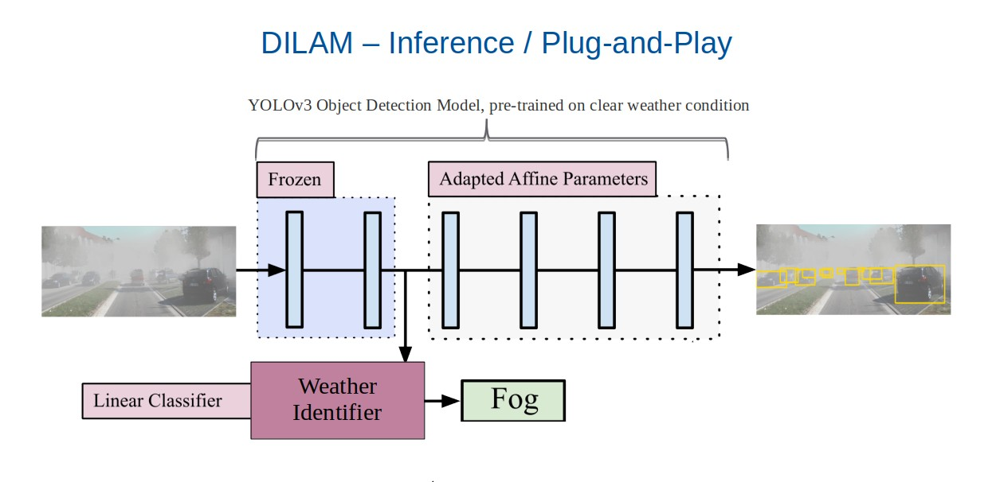

# Weather Classifier
Image Weather Classification module from [DILAM paper](https://arxiv.org/abs/2305.18953) & [DILAM Github](https://github.com/jmiemirza/DILAM). 

This machine learning approach uses the first two layers of [YOLOv3](https://github.com/ultralytics/yolov3) (commit d353371) object detection model, pre-trained on a clear weather 
dataset, for further image classication of adverse weather conditions.



## Installation on Ubuntu 20.04
* Clone the repository recursively:
```bash
git clone --recurse-submodules https://github.com/nadezola/weather_classifier.git
```
* If you already cloned and forgot to use `--recurse-submodules` you can run: 
```bash
git submodule update --init
```

* We recommend to use Python3.8 virtual environment with `requirements.txt`:

```bash
# apt install python3.8-venv
python3.8 -m venv .venv
source .venv/bin/activate
pip install --upgrade pip
pip install -r requirements.txt
```


## Dataset preparation
### Data structure:
```
data_root
|
├── images
|      ├──── test
|      |      ├─── *.jpg
|      |
|      ├──── train
|      |      ├─── *.jpg
|      |
|      └──── val
|             ├─── *.jpg
|
├── splits
|      ├──── clear
|      |      ├─── train.txt
|      |      └─── val.txt
|      |
|      ├──── fog
|      |      ├─── train.txt
|      |      └─── val.txt
|      |
|      ├──── rain
|      |      ├─── train.txt
|      |      └─── val.txt
|      |
|      └─── snow
|            ├─── train.txt
|            └─── val.txt
|
├── test.txt
├── train.txt
├── val.txt
|
└── weather_labels.csv 
```
* `test.txt`, `train.txt`, `val.txt` contain a list of images defining the train/val/test splits.

### Splitting by Weather Condition:
* To train the Weather Classifier for 4 classes: _**clear, fog, rain, snow**_, you need to split 
the entire `train.txt` and `val.txt` by weather conditions and fill up the folder `splits`
* We provide example code to split the entire `train.txt` and `val.txt` by weather conditions, using
`weather_labels.csv` annotation file  
* Example of `weather_labels.csv`:

| Hash              | Weather |
|-------------------|---------|
| vienna20181007_f0 | fog     |
| vienna20181007_f1 | fog     |
| ...               |         |
| vienna20181015_f0 | rain    |

* Usage:
```bash
python data_splitting.py --data_root <path/to/data_root> 
                         --weather_lbls <path/to/weather_labels>
                         --res_dir <path/to/folder/where/to/save/results>
```

## Train
Train the Weather Classification Head
* Configure `opt.py` file
* Pre-train the [YOLOv3](https://github.com/ultralytics/yolov3) model commit d353371 on clear weather dataset for your object detection task 
and put the pre-trained model in `checkpoints` folder
* Run:
```bash
python main.py --data_root <path/to/data/root/> 
               --mode 'train'
               --res_dir <path/to/folder/where/to/save/results>
```

## Evaluate
Evaluate the Weather Classification performance on validation dataset.
* Configure `opt.py` file
* Put the weights of Weather Classification Head in `checkpoints` folder
* Run:
```bash
python main.py --data_root <path/to/data/root/> 
               --mode 'eval'
               --weights <path/to/weather/classification/weights>
               --res_dir <path/to/folder/where/to/save/results>
               # --novis option to DO NOT visualize weather classification results
```

## Predict
Play the Weather Classifier on test dataset. No labels needed.
* Configure `opt.py` file
* Put the weights of Weather Classification Head in `checkpoints` folder
* Run:
```bash
python main.py --data_root <path/to/data/root/> 
               --mode 'predict'
               --weights <path/to/weather/classification/weights>
               --res_dir <path/to/folder/where/to/save/results>
               # --novis option to DO NOT visualize weather classification results
```